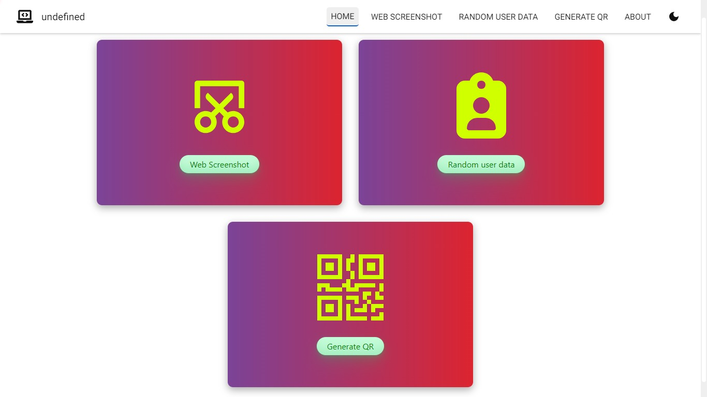
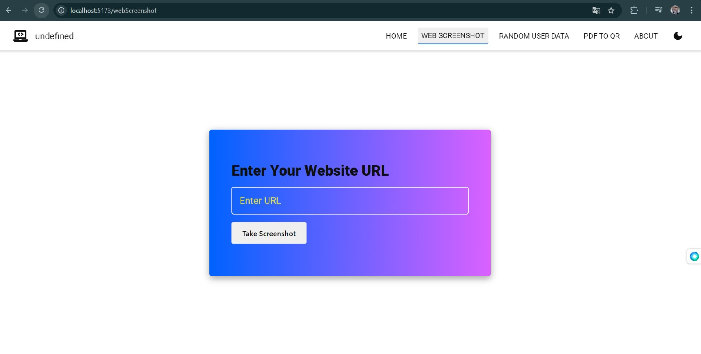
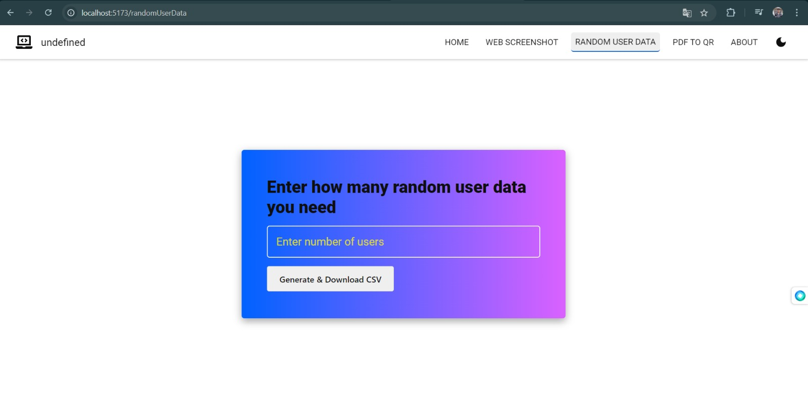
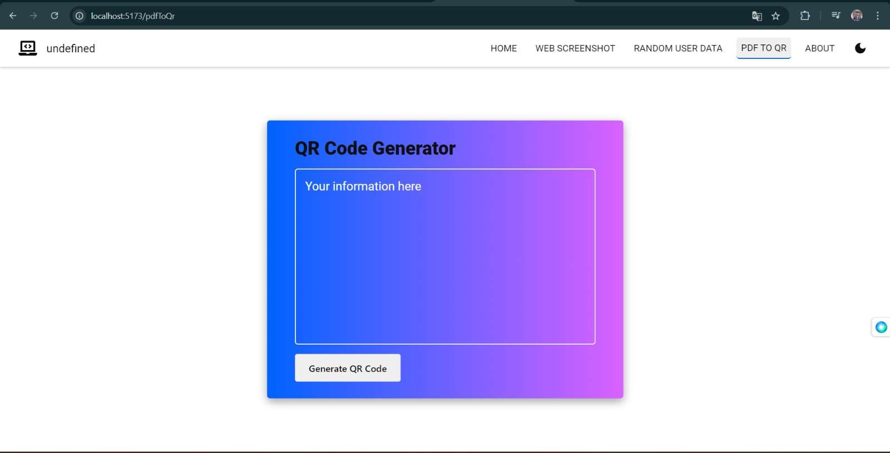

# Web Screenshot App, Random User Data Generator and PDF with QR Code Generator

## Project Description

1. *Web Screenshot App*:A web application that takes screenshots of any given website URL and  displays the captured screenshot and if you wnat you can download it.
2. *Random User Data Generator*: A web app that generates random user data and downloads it in CSV format.
3. *PDF with QR Code Generator*: A web app that takes user input, generates a QR code, and embeds it in a downloadable PDF.

Both applications are built using React.js and use third-party APIs to fetch and display data.

## Features
### Web Screenshot App
- User can input the website URL.
- Fetches the sereenshot by useing third-party API name Screenshot API.
- If user want user can download the sereenshot in jpeg format.

### Random User Data Generator
- User can specify how many random users to generate.
- Fetches user data from the Random User API.
- Automatically downloads the generated data in CSV format.

### PDF with QR Code Generator
- User can input any text.
- Generates a QR code based on the input.
- Exports the QR code along with the input as a downloadable PDF.

## Tech Stack
- *React.js*
- *Axios*
- *Screenshot API*
- *Random User API*
- *jsPDF*
- *qrcode.react*

## Installation

1. Clone the repository:
   ```bash
   git clone https://github.com/your-username/your-repository-name.git
   cd your-repository-name
   npm install
   npm start dev
## Usage

### Web Screenshot App
1. Open the app in your browser.
2. Click the Web Screenshot button.
3. Enter URL of the website you want to take screenshot.
4. Click the "Take Screenshot" button to fetch the data and download the CSV.

### Random User Data Generator
1. Open the app in your browser.
2. Click the Random User Data button.
3. Enter the number of users you want to generate.
4. Click the "Generate & Download CSV" button to fetch the data and download the CSV.

### PDF with QR Code Generator
1. Open the app in your browser.
2. Click the PDF TO QR button.
3. Enter the text you want to generate a QR code for.
4. Click the "Generate QR" button to download the PDF.

## Screenshots


### Home page


### Web Screenshot 


### Random User Data Generator


### PDF with QR Code Generator


## API References

- [Web Screenshot API](https://app.abstractapi.com/dashboard)
  - This API help to take screenshot any website in the project.

- [Random User API](https://randomuser.me/)
  - This API provides the random user data used in the project.


## Acknowledgements

- [React.js](https://reactjs.org/)
- [jsPDF](https://github.com/parallax/jsPDF)
- [qrcode.react](https://www.npmjs.com/package/qrcode.react)
- [Web Screenshot API](https://app.abstractapi.com/dashboard)
- [Random User API](https://randomuser.me/)